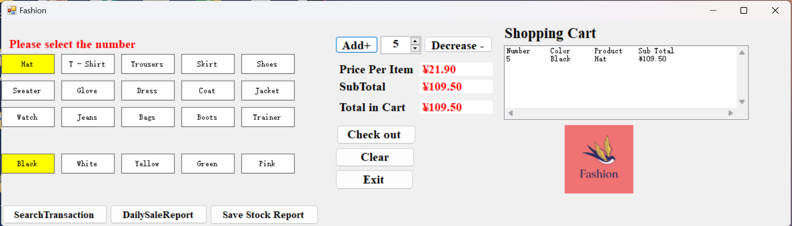
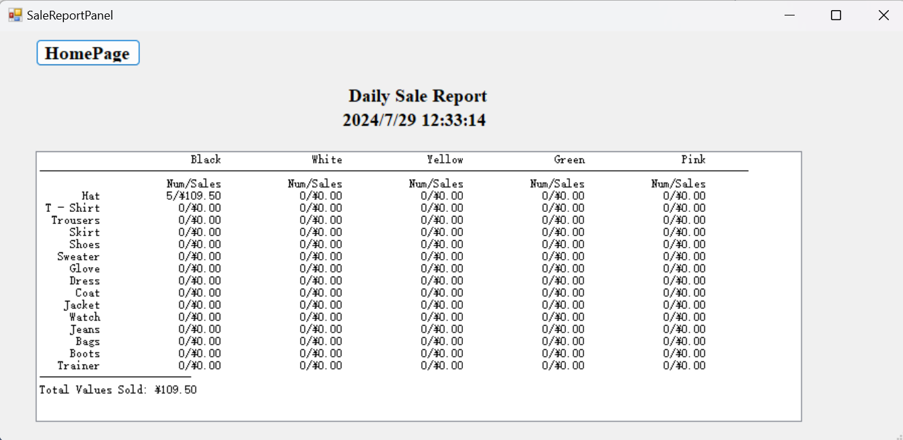
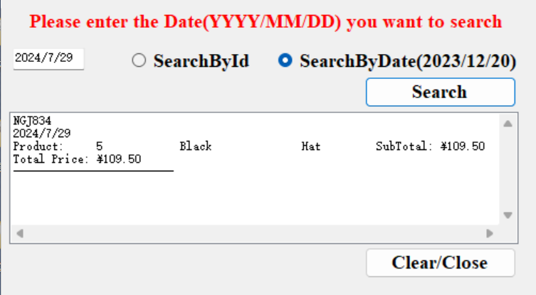

# 👗 Clothing Store POS Application

## Overview

Welcome to the **Clothing Store POS (Point of Sale) Application**, a C# WinForms-based software solution specifically designed for clothing retail businesses. This application simplifies the sales process by providing an intuitive and efficient interface to manage transactions, generate sales reports, and maintain customer satisfaction.
[Github Link:](https://github.com/zhengshihan/EPOS)

## Key Features

### 1. 🛒 Add Items to Cart

- **User-Friendly Interface:** Easily browse and select items from the store's inventory.
- **Real-Time Cart Updates:** Quickly add items to the shopping cart with automatic calculations for totals, taxes, and discounts.

### 2. 💳 Checkout Process

- **Seamless Transactions:** Complete transactions with just a few clicks.

### 3. 📄 Invoice Management

- **Automated Invoice Creation:** Generate detailed invoices upon successful checkout.
- **Text File Storage:** Save invoices as text files for easy record-keeping and later retrieval.

### 4. 📊 Sales Reporting

- **Comprehensive Reports:** Generate daily reports to monitor store performance.

### 5. 🔍 Order Lookup by Order Number

- **Efficient Search:** Quickly search for previous orders using a unique order number.
- **Detailed Order Information:** View complete order history

## Technical Specifications

- **Platform:** 🖥️ Windows
- **Language:** 🛠️ C# (.NET Framework)
- **User Interface:** 🎨 Windows Forms
- **Database:** 📂 Local database for inventory management and sales data
- **File Handling:** 🗂️ Text files for storing invoices and sales reports

## How to Use

### 🛒 Adding Items to Cart

1. **Select Item:** Choose items from the inventory list.
2. **Specify Quantity:** Enter the desired quantity for each selected item.
3. **Add to Cart:** Click the "Add to Cart" button to include items in the shopping cart.
4. **Review Cart:** Review all selected items before proceeding to checkout.

### 💳 Completing Checkout

1. **Review Order:** Ensure all items and quantities are correct in the cart.
2. **Receive Invoice:** An invoice is generated and saved as a text file upon successful payment.

### 📊 Generating Sales Reports

1. **Generate Report:** Click "Generate Report" to create a sales report.

### 🔍 Order Lookup

1. **Enter Order Number:** Input the unique order number in the search field.
2. **Search Orders:** Click the "Search" button to locate the order.
3. **View Details:** Access detailed information about the order, including items, customer info, and payment status.

## Screenshots

*The main interface of the Clothing Store POS Application, displaying inventory and the shopping cart.*

*An example of a generated sales report, showing daily sales statistics.*

## Future Enhancements

- **📦 Inventory Management:** Enhance inventory tracking with real-time stock updates
