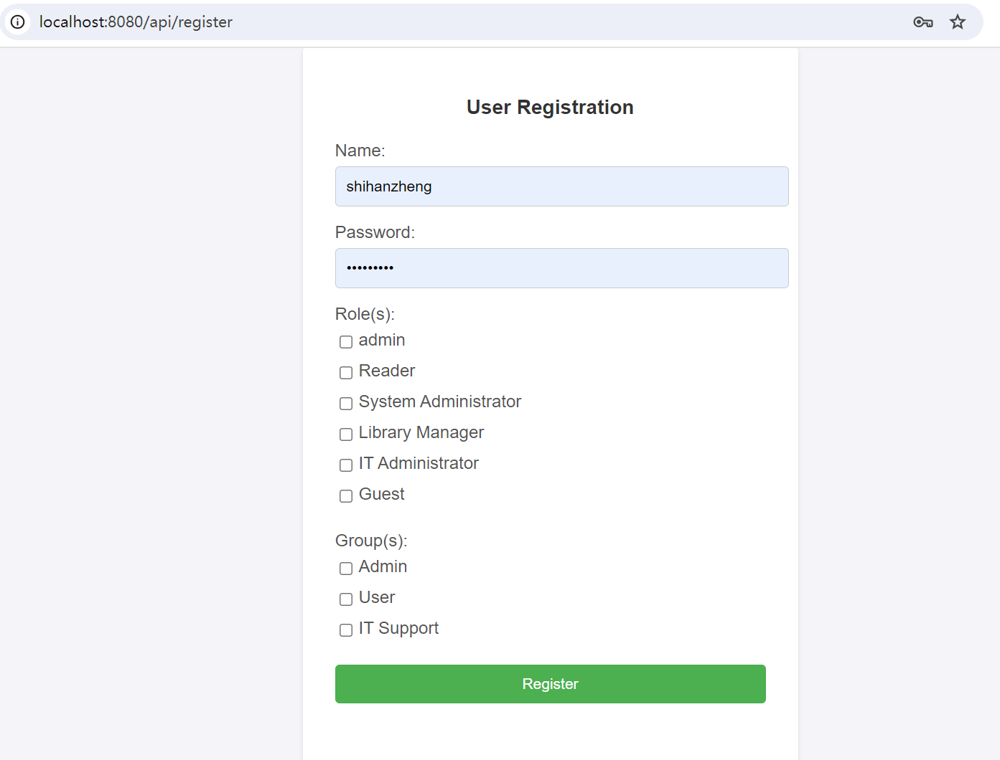

# Book Management System

## Introduction

The **Book Management System** is a comprehensive web application designed to facilitate efficient management of books with features that include book listing, book searching, user login/registration, and role-based access control. This project aims to provide an intuitive and user-friendly interface for both administrators and users to interact with the book database effectively.

## Features

- **Book Listing**: Display a comprehensive list of books available in the system.
- **Book Searching**: Search functionality to quickly find books by title, author, genre, or other attributes.
- **User Login/Registration**: Secure authentication system allowing users to register and log in to the application.
- **Role-Based Access Control**: Implement different levels of access permissions based on user roles (e.g., admin, user).
  
  
  

## Technology Stack

- **Frontend**: Thymeleaf
- **Backend**: Spring Boot
- **Data Access**: Spring Data JPA
- **Database**: MySQL
- **Containerization**: Docker
- **Continuous Integration/Continuous Delivery (CI/CD)**: Jenkins
- **Development Environment**: Tomcat 8.5.87, Maven 3, Git, Spring Tool Suite

## Implementation Details

### 1. Spring Data JPA

The application leverages **Spring Data JPA** to automate the creation of repository interfaces and manage CRUD operations seamlessly. This integration simplifies the interaction with the underlying JPA provider such as Hibernate, enhancing the application's data access layer.

### 2. Data Relationships

The system handles complex **one-to-many** and **many-to-many** relationships, enabling robust data modeling and querying capabilities. This approach optimizes database operations, ensuring efficient data retrieval and manipulation.

### 3. Unit Testing

The backend code is rigorously tested with a unit test coverage exceeding 85% using **JUnit** and **Mockito**. This high coverage ensures the reliability and stability of the application's core functionalities.

### 4. Docker Containerization

The application is containerized using **Docker**, which ensures consistent environments across development, testing, and production phases. This approach simplifies the deployment process by providing isolated and portable containers, making it easier to manage application dependencies.

### 5. CI/CD with Jenkins

**Jenkins** is used to automate the deployment process, facilitating continuous integration and continuous delivery (CI/CD). The automation pipeline includes building and deploying the application to a local Tomcat server, streamlining the development workflow.

## Development Environment

- **Web Server**: Apache Tomcat 8.5.87
- **Build Tool**: Maven 3
- **Version Control**: Git
- **IDE**: Spring Tool Suite
- **Database**: MySQL

## Conclusion

The Book Management System is a robust and scalable solution designed to meet the needs of modern libraries and bookstores. By integrating advanced technologies and following industry best practices, this application ensures a seamless user experience and efficient book management processes. Whether you are an administrator managing inventory or a user searching for your next read, this system provides all the necessary tools to enhance book managemen

